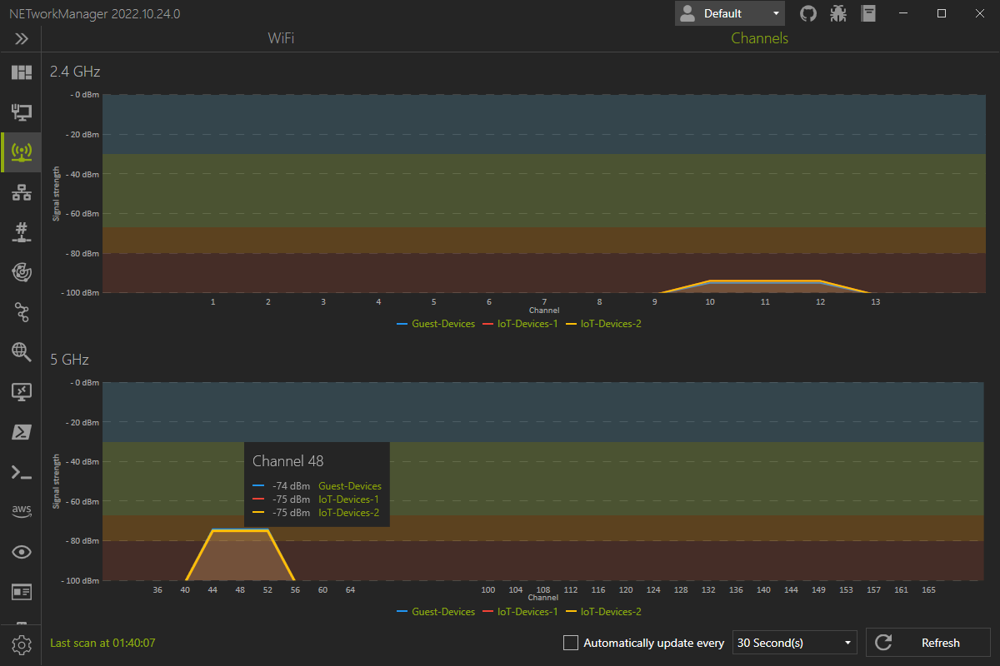

# WiFi
The WiFi shows all available wireless networks with additional details such as channel, signal strength or the type of encryption used.

Hidden wireless networks are displayed as `Hidden Network`. 

## WiFi

You can select which wireless network adapter is used to scan for wireless networks. Wireless networks can be filtered by 2.4 Ghz, 5 Ghz and the SSID.

Due to limitations of the `Windows.Devices.WiFi` API the channel bandwidth cannot be detected.

## Channels

In the channels view, all wireless networks are displayed graphically, with channel and signal strength. This can be useful to identify overlapping wireless networks that are not from the same access point.

You can move the mouse over the channel to display all wireless networks that occupy this channel.

