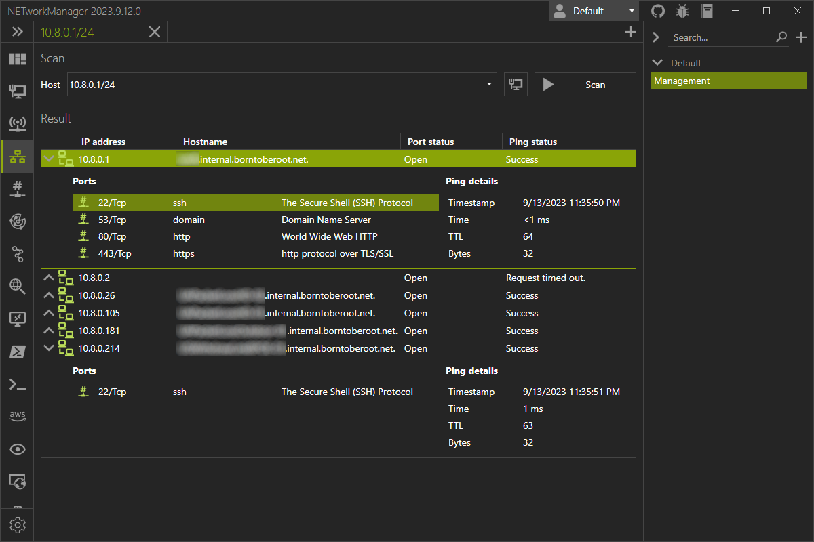

# IP Scanner

## Profile

## Settings

* Show Scan results for all IP addresses - On/Off     Default Off

Set to on displays all IP addresses scanned.  Off will show only the IP addresses that responded. 

* Multithreading - Threads - Int between 1 and 15000     Default 256

The number of threads the scan will utilise.  The higher the number of threads the quicker the scan.  If the number is too higher, some networks switches may block the port, due to storm control/dos protection/loop protection.

* Ping Timeout (ms) - Int between 100 and 1500     Default 400

* Buffer - Int Between 1 and 65535     Default 35

* Attempts - Int Between 1 and 10     Default 2

The number of arp/tcp requests sent to each IP address in the scan.  The higher the number, the longer the scan will take.  Default settings should be suitable for most networks. 

## Examples

Single IPv4
1.1.1.1

Single IPv6
fe08::001

Subnet IPv4
10.10.10.0/24

Multiple Subnets IPv4
10.10.10.0/24;192.168.1.1/24

Range of IPv4
192.168.11.[1-50]

Mix and Match from above
1.1.1.1;fe08::001;10.10.10.0/24;192.168.1.1/24;192.168.11.[1-50]
