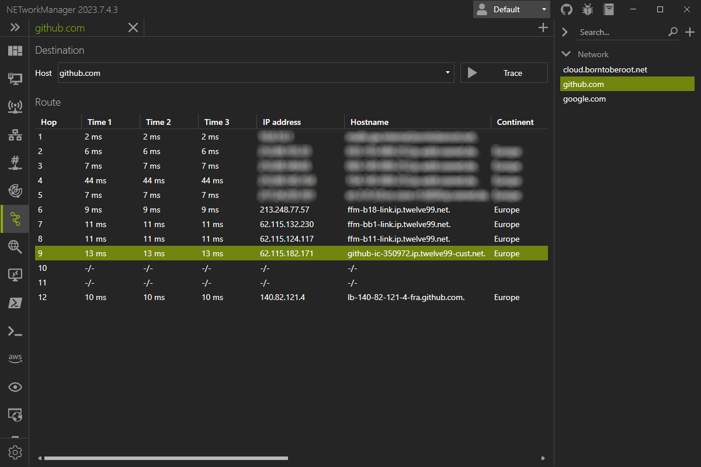

# Traceroute

With the **Traceroute** you can trace the route to a host with ICMP echo requests to determine the path to the specific host.

Example inputs:

- `server-01.borntoberoot.net`
- `10.0.0.1`

## Profile

### Inherit host from general

Inherit the host from the general settings.

**Type:** `Boolean`

**Default:** `Enabled`

{: .note }
If you enable this option, the [host](#host) is overwritten by the host from the general settings and the [host](#host) is disabled.

### Host

Hostname or IP address to ping.

**Type:** `String`

**Default:** `Empty`

**Example:**

- `server-01.borntoberoot.net`
- `1.1.1.1`

## Settings

### Maximum hops

Maximum hops to search for target.

**Type:** `Integer` [Min `1`, Max `255`]

**Default:** `30`

### Timeout (ms)

Timeout in milliseconds for the icmp packet after which the packet is considered lost.

**Type:** `Integer` [Min `100`, Max `15000`]

**Default:** `4000`

### Buffer

Buffer size of the icmp packet.

**Type:** `Integer` [Min `1`, Max `65535`]

**Default:** `32`

### Resolve hostname

Resolve the hostname of the IP address (PTR lookup) for each hop.

**Type:** `Boolean`

**Default:** `True`
