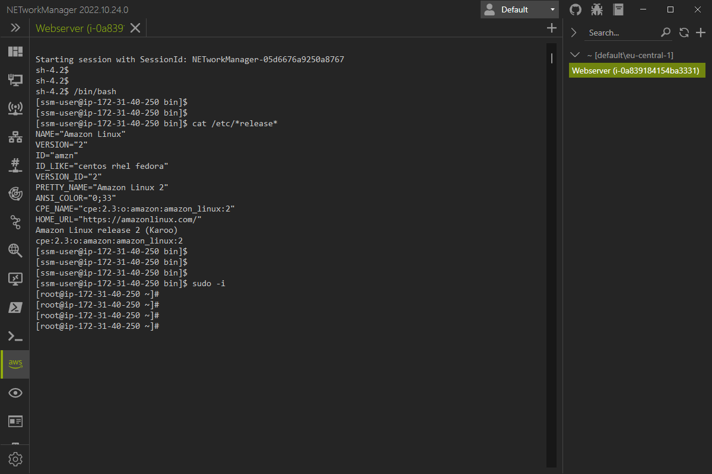

# AWS Session Manager

With AWS (Systems Manager) Session Manager, you can connect to and manage an EC2 instance without opening inbound ports, running a bastion host, or managing SSH keys. Here you can find more information about [AWS Systems Manager](https://aws.amazon.com/systems-manager/){:target="\_blank"} and the documentation for [AWS Systems Manager Session Manager](https://docs.aws.amazon.com/systems-manager/latest/userguide/session-manager.html){:target="\_blank"}.

This feature allows you to use the `aws ssm start-session --target <INSTANCE_ID>` command with tabs. You can create profiles for your instances or synchronize them from AWS EC2 to connect to them directly.



## Requirements

To be able to use the AWS Session Manager, some preconditions must be fulfilled.

### Setup AWS Systems Manager Session Manager

Instance role / profile

```json
{
    "Version": "2012-10-17",
    "Statement": [
        {
            "Effect": "Allow",
            "Principal": {
                "Service": "ec2.amazonaws.com"
            },
            "Action": "sts:AssumeRole"
        }
    ]
}
```

Instanc policy

```
arn:aws:iam::aws:policy/AmazonSSMManagedInstanceCore
```` 

### Setup AWS CLI & Session Manager plugin

The AWS CLI and AWS Session Manager plugin is required on **your computer** to run the `aws ssm start-session` command. You can download them here:

- [AWS CLI](https://aws.amazon.com/cli/){:target="\_blank"} (direct link [Windows installer](https://awscli.amazonaws.com/AWSCLIV2.msi){:target="\_blank"})
- [AWS Session Manager plugin](https://docs.aws.amazon.com/systems-manager/latest/userguide/session-manager-working-with-install-plugin.html){:target="\_blank"} (direct link [Windows installer](https://s3.amazonaws.com/session-manager-downloads/plugin/latest/windows/SessionManagerPluginSetup.exe){:target="\_blank"})

> **NOTE:** The installation is described in the AWS documentation.

### AWS IAM policy

Sync policy

```json
{
    "Version": "2012-10-17",
    "Statement": [
        {
            "Sid": "AllowNETworkManagerSync",
            "Effect": "Allow",
            "Action": [
                "ec2:DescribeInstances",
                "ec2:DescribeInstanceStatus"
            ],
            "Resource": "*"
        }
    ]
}
```

Connect policy

```json
{
    "Version": "2012-10-17",
    "Statement": [
        {
            "Effect": "Allow",
            "Action": [
                "ssm:StartSession"
            ],
            "Resource": [
                "arn:aws:ec2:eu-central-1:<ACCOUNT_ID>:instance/*"
            ]
        },
        {
            "Effect": "Allow",
            "Action": [
                "ssm:DescribeSessions",
                "ssm:GetConnectionStatus",
                "ssm:DescribeInstanceProperties",
                "ec2:DescribeInstances"
            ],
            "Resource": "*"
        },
        {
            "Effect": "Allow",
            "Action": [
                "ssm:TerminateSession",
                "ssm:ResumeSession"
            ],
            "Resource": [
                "arn:aws:ssm:*:*:session/${aws:username}-*"
            ]
        }
    ]
}
```

## Profile

### Instance ID

### Profile

### Region

## Settings


