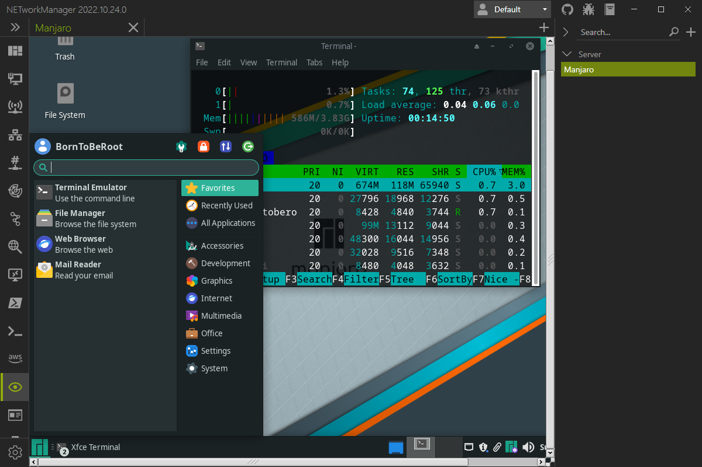

# TigerVNC

With **TigerVNC** you can connect to a remote computer via VNC. The integration of TigerVNC with NETworkManger supports tabs and profiles for hosts. The connection can be established via a profile (double-click, Enter key or right-click `Connect`) or directly via the [connection](#connect) dialog.

Right-click on the tab will open the context menu with the following options:

- **Reconnect** - Restart TigerVNC and reconnect to the remote computer.

{: .info}
Virtual Network Computing (VNC) is a remote display protocol that allows you to control the desktop environment of a computer remotely. VNC uses the Remote Frame Buffer (RFB) protocol to transmit keyboard and mouse events from the client to the server and screen updates from the server to the client. VNC is platform-independent and supports Windows, Linux and macOS.

{: .info}
TigerVNC is a high-speed version of VNC based on the RealVNC 4 and X.org code bases. TigerVNC started as a next-generation development effort for TightVNC on Unix and Linux platforms, but it split from its parent project in early 2009 so that TightVNC could focus on Windows platforms. TigerVNC supports a variant of Tight encoding that is greatly accelerated by the use of the libjpeg-turbo JPEG codec. See [TigerVNC repository](https://github.com/TigerVNC/tigervnc/){:target="\_blank"} for more details.

{: .note}
TigerVNC must be installed on the local computer in order to use this feature. You can download the latest version of TigerVNC from the [official website](https://tigervnc.org/){:target="\_blank"}.

## Connect

### Host

Host to connect to via VNC.

**Type:** `String`

**Default:** `Empty`

**Example:**

- `server-01.borntoberoot.net`
- `10.0.0.10`

### Port

TCP port to use for the VNC connection.

**Type:** `Integer` [Min `1`, Max `65535`]

**Default:** [`Settings > Port`](#port-3)

## Profile

### Inherit host from general

Inherit the host from the general settings.

**Type:** `Boolean`

**Default:** `Enabled`

{: .note }
If this option is enabled, the [Host](#host-1) is overwritten by the host from the general settings and the [Host](#host-1) is disabled.

### Host

Host to connect to via VNC.

**Type:** `String`

**Default:** `Empty`

**Example:**

- `server-01.borntoberoot.net`
- `10.0.0.10`

### Port

TCP port to use for the VNC connection.

**Type:** `Integer` [Min `1`, Max `65535`]

**Default:** `5900`

## Group

### Port

TCP port to use for the VNC connection.

**Type:** `Integer` [Min `1`, Max `65535`]

**Default:** `5900`

## Settings

### File path

Path to the TigerVNC executable.

**Type:** `String`

**Default:** `Empty`

**Example:**

- `C:\path\to\vncviewer-x.x.x.exe`
- `C:\path\to\vncviewer64-x.x.x.exe`

{: .note }
The `Configure` button opens the TigerVNC application to configure it.

### Port

Default TCP port to use for the VNC connection.

**Type:** `Integer` [Min `1`, Max `65535`]

**Default:** `5900`
