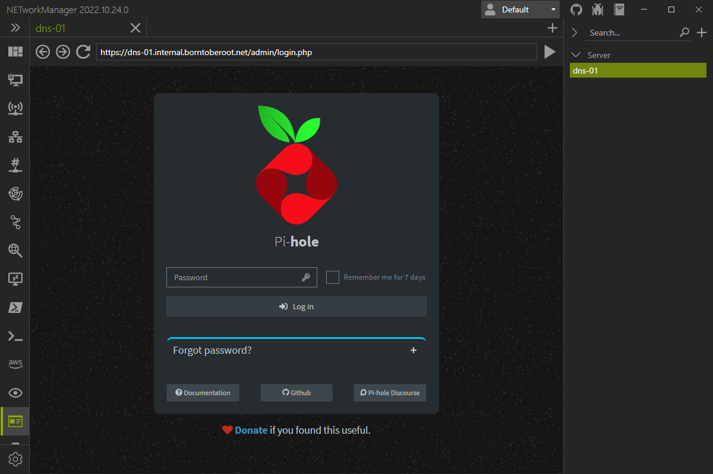

# Web Console

The **Web Console** is designed to browse the website of a host (e.g. server, switch, router, dashboard, etc.) to display informations or to configure it.

Possible inputs:
- `https://pihole.example.com/admin/`

## Profile

### URL

URL of the website to display in the web console.

**Type:** `String`

**Default:** `Empty`

**Example:** `https://pihole.example.com/admin/`

## Settings

### Show address bar

Show or hide the navigation / address bar.

**Type:** `Boolean`

**Default:** `Enabled`
