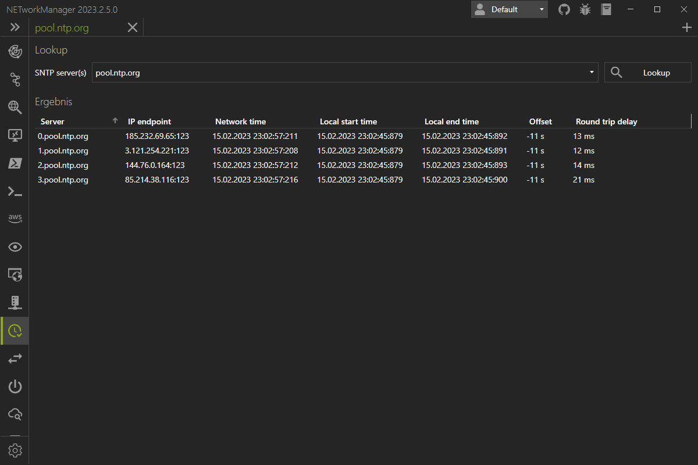

# SNTP Lookup

New Feature
{: .label .label-green }

2023.3.7.0
{: .label .label-purple }

With **SNTP Lookup** you can query one or more SNTP servers to get the current network time.
SNTP server and get the network current time. It will also show the offset to the local time.

{: .info}
SNTP (Simple Network Time Protocol) is a protocol used for synchronizing time between computer systems on a network. It is a simplified version of the Network Time Protocol (NTP) that is widely used for time synchronization. SNTP is designed to provide a basic level of accuracy and is used when precise timing is not critical. SNTP servers typically obtain their time from other NTP or SNTP servers and distribute the time to client devices on the network. SNTP operates over the User Datagram Protocol (UDP) and typically uses port 123. It is widely supported by many operating systems and network devices and is an important component of network infrastructure.

{: .note}
Right-click on the result to copy or export the information.

## Settings

### SNTP servers

List of SNTP server profiles. A profile can contain one or more SNTP servers with host/IP address and port.

**Type:** `List<NETworkManager.Models.Network.ServerConnectionInfoProfile>`

**Default:**

| Name              | Server(s)                                                                                                     |
| ----------------- | ------------------------------------------------------------------------------------------------------------- |
| Cloudflare        | `time.cloudflare.com:123`                                                                                     |
| Google Public NTP | `time.google.com:123; time1.google.com:123; time2.google.com:123; time3.google.com:123; time4.google.com:123` |
| Microsoft         | `time.windows.com:123`                                                                                        |
| pool.ntp.org      | `0.pool.ntp.org:123; 1.pool.ntp.org:123; 2.pool.ntp.org:123; 3.pool.ntp.org:123`                              |

{: .note }
At least one SNTP server profile must exist.

### Timeout (ms)

Timeout in milliseconds after the SNTP request is canceled.

**Type:** `Integer` [Min `100`, Max `15000`]

**Default:** `4000`
