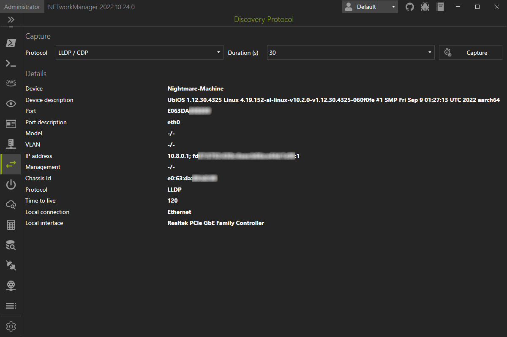

# Discovery Protocol

In **Discovery Protocol** you can capture for LLDP (Link Layer Discovery Protocol) and/or CDP (Cisco Discovery Protocol) frames to see to which switch or router your device is connected. The information such as device name, port, VLAN, etc. are displayed in a table.

{: .info }
The Link Layer Discovery Protocol (LLDP) is a vendor-neutral Layer 2 network protocol used by network devices, especially switches, to advertise their identity, capabilities, and neighbors on an IEEE 802 Local Area Network (LAN). If configured, LLDP messages are sent out periodically as frames with the destination MAC address of `01:80:c2:00:00:0e`. The default time interval is 30 seconds.

{: .info }
The Cisco Discovery Protocol (CDP) is a proprietary Layer 2 protocol used by Cisco Systems to exchange information about network devices. If configured, CDP messages are sent out periodically as frames with the destination MAC address `01:00:0c:cc:cc`. The default time interval is 60 seconds.

{: .warning }
If you are using a hypervisor like Hyper-V with a virtual switch configured as "External network" which is shared with host where NETworkManager is running, you may not receive any packets. This is because the virtual switch does not forward the LLDP or CDP frames to the host. You may temporarily change the virtual switch to "Internal network" or "Private network", if you want to use the Discovery Protocol to see which switch or router your device is connected to. You can also verify this behavior by using Wireshark.

