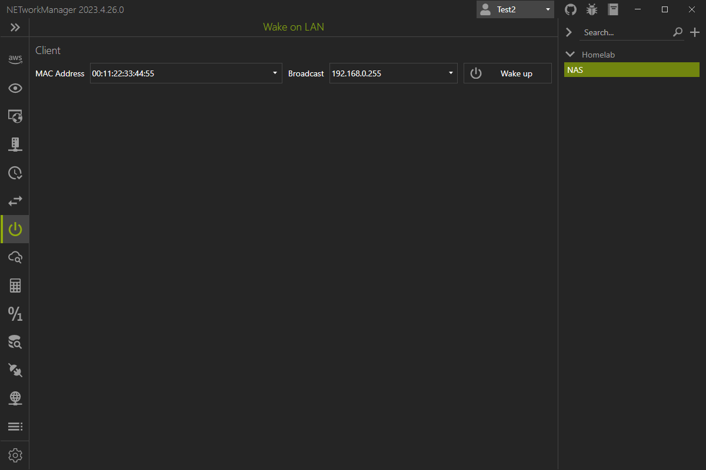

# Wake on LAN

With **Wake on LAN** you can wake up a computer in the local network from a low power state. 

{: .info }
Wake on LAN uses a magic packet starting with 6 bytes with the value `0xFF` followed by 16 repetitions of the MAC address of the computer to be woken up. The magic packet is sent on layer 2 to the broadcast address via port `9/udp` of the network where the computer is located. The computer must be in a low power state in order to detect the magic packet and wake up.

{: .note}
The computers network interface card (NIC) must support Wake on LAN and the feature must be enabled in the BIOS. The computer must also be connected to the network via cable. Wake on LAN does not work over WLAN. You may need to configure your firewall to let the magic packet through.

Possible inputs:

| MAC address         | Broadcast address | Note                                     |
| ------------------- | ----------------- | ----------------------------------------------- |
| `00:11:22:33:44:55` | `192.168.0.255`   | Broadcast address of a `192.168.0.0/24` network |

## Profile

### MAC address

MAC address of the device to wake up.

**Type:** `String`

**Default:** `Empty`

**Example:** `00:11:22:33:44:55`

### Broadcast

Broadcast address of the network in which the device is located.

**Type:** `String`

**Default:** `Empty`

**Example:** `192.168.0.255`

## Settings

### Port

UDP port on which the magic packet is sent.

**Type:** `Integer` [Min `1`, Max `65535`]

**Default:** `9`
