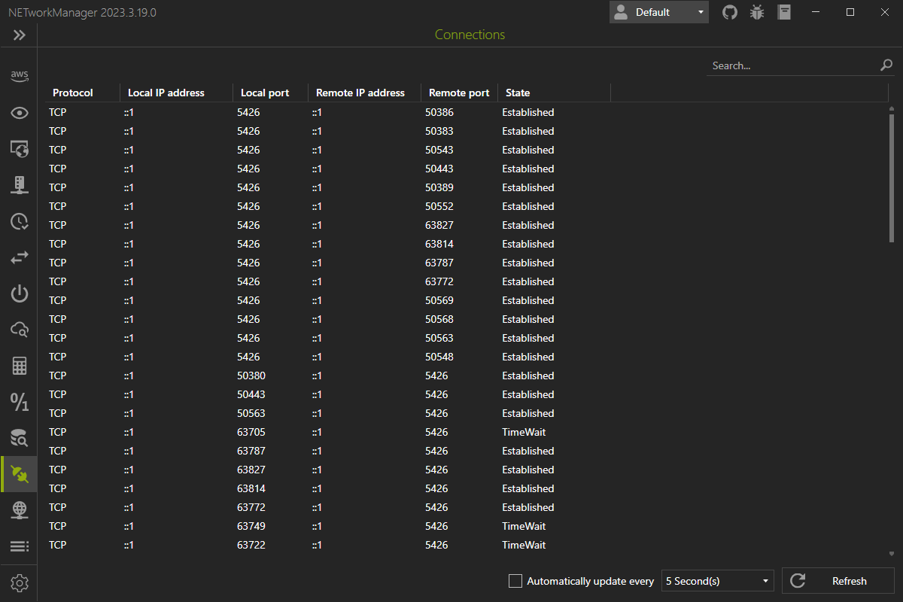

# Connections

In **Connections** you can see all the connections with source and destination IP addresses and port that are currently running on your computer.

{: .note}
Right-click on the result to copy or export the information.
