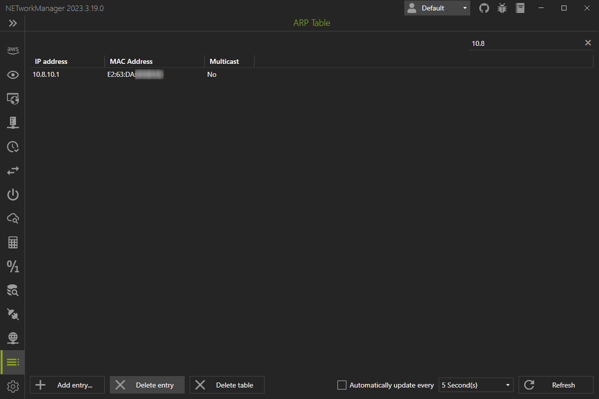

# ARP Table

The **ARP table** shows you the IP address and MAC address of all devices on your network with which the computer has already established a connection.

{: .info}
ARP (Address Resolution Protocol) is a layer 2 protocol for mapping IP addresses to MAC addresses. The ARP table is a list of all IP addresses and the corresponding MAC addresses of the devices on the network. When a device needs to send data to a specific IP address, it first checks its ARP table to see if it already has the MAC address for that IP address. If the MAC address is not found in the ARP table, the device will send a broadcast message called an ARP request to the network asking which device owns that IP address. The device that owns the IP address will then respond with its MAC address, and the requesting device will update its ARP table with the new mapping. ARP cache poisoning attacks can manipulate the contents of the ARP table, leading to security issues.

In addition, further actions can be performed using the buttons at the bottom left:

- **Add entry...** - Opens a dialog to add an entry to the ARP table.
- **Delete entry** - Delete the currently selected entry from the ARP table.
- **Delete table** - Delete all entries from the ARP table.

{: .note}
Right-click on the result to copy or export the information.
