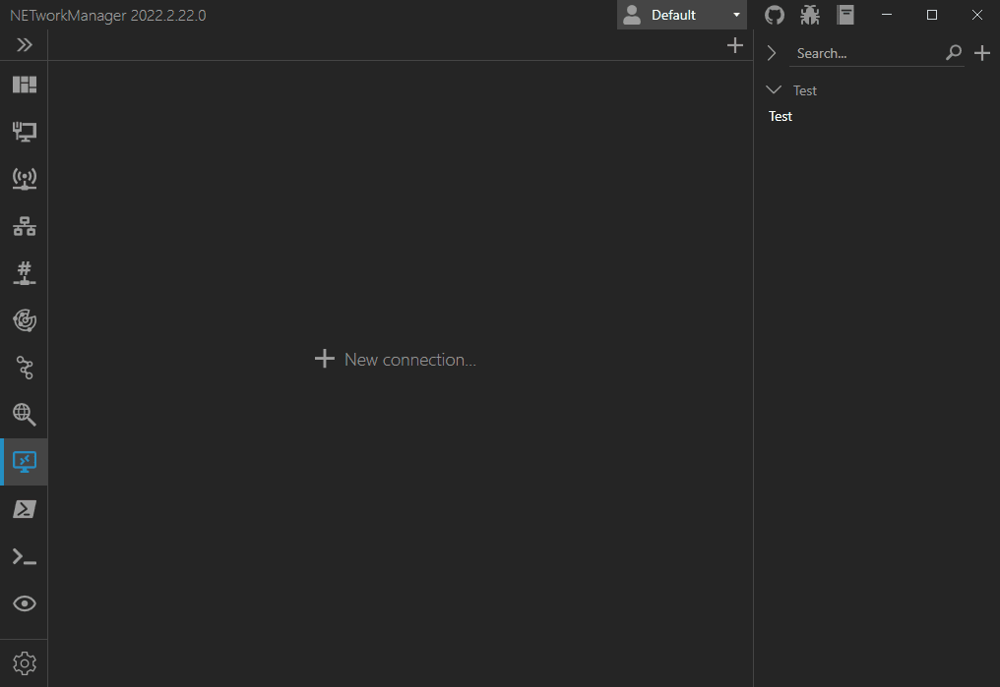

# Profile file encryption

### How does the profile encryption work?

Profile files are encrypted on disk using [AES](https://docs.microsoft.com/de-de/dotnet/api/system.security.cryptography.aes){:target="\_blank"} with a key size of 256 bits and a block size of 128 bits in CBC mode. The encryption key is derived from a master password using [Rfc2898DeriveBytes](https://docs.microsoft.com/en-US/dotnet/api/system.security.cryptography.rfc2898derivebytes){:target="\_blank"} (PBKDF2) with 1,000,000 iterations. At runtime, passwords are stored as [SecureString](https://docs.microsoft.com/en-US/dotnet/api/system.security.securestring){:target="\_blank"} once the profile file is loaded. For some functions, the password must be converted to a normal string and may remains unencrypted in memory until the garbage collector cleans them up. If you found a security issue, you can report it [here](https://github.com/BornToBeRoot/NETworkManager/security/policy){:target="\_blank"}!

### How to enable profile file encryption?

Open the settings and go to the profile section. Right click on the profile file you want to encrypt. Select `Encryption...` > `Enable encryption...` and set your master password.

### How to change the master password of an encrypted profile file?

Open the settings and go to the profile section. Right click on an encrypted profile file. Select `Encryption...` > `Change Master Password...` and enter the current master password and a new master password.

### How to disable profile file encryption?

Open the settings and go to the profile section. Right click on an encrypted profile file. Select `Encryption...` > `Disable encryption...` and enter your master password.

